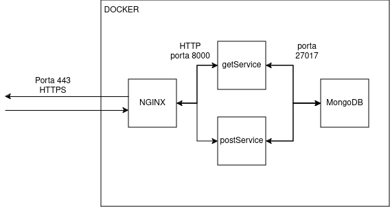

# simples API para consulta e cadastro de produtos
## intro e stack
Depois de fazer um pequeno teste usando o API gateway da AWS junto com funções lambda (serverless), se optou pelo desenvolvimento do exercício usando docker-compose e o nginx como API gateway.

Embora sua função principal seja a de um servidor http, load balancer e proxy reverso, o nginx é open source e extremamente configurável, podendo facilmente ser usado também como gateway para APIs. Ele permite a distribuição de carga entre mais de um servidor, autenticação e autorização, limitação de fluxo e etc. Para casos simples como o deste exercicio, serve perfeitamente.

O desenvolvimento do exercício em docker também foi uma oportunidade para se estudar mais a fundo alguns dos conceitos por trás das apis e microserviços, já que o docker-compose permite recriar de forma fácil a relação entre vários serviços conectados através de uma rede privada.

## desenho da solução



A solução envolve múltiplos containers, um para cada serviço. são duas aplicações flask em python, um banco de dados mongoDB e o NGINX, que funciona de API gateway e é o único acessível fora da orquestração do docker -- através da porta 443 (https).

O nginx direciona as requisições para cada container de acordo com a rota da API que foi chamada. Os “microserviços” por sua vez se conectam ao banco de dados através da rede interna do compose. Desse modo os containers e o banco de dados não ficam acessíveis "externamente".

A escolha do mongoDB como banco de dados se deu pela facilidade de configuração e pelo cliente/biblioteca acessível para se usar com python.

## segurança

A API usa https e também possui um sistema simples de autorização e autenticação através do uso de "API keys". Para se usar basta inserir um novo campo ‘apikey’ nos headers da requisição com o valor:

`"apikey":umachavesimples`

## Rotas e exemplos de payload

Existem três rotas possíveis:

#### GET /api/produtos

traz uma lista de todos os produtos cadastrados no sistema

exemplo de resposta:
```json
[
  {
    "_id": "662555e440c80009f12c7908",
    "nome": "coca-cola",
    "preco": 10.5
  },
  {
    "_id": "6625bb234536c9a9dac1baa0",
    "nome": "fanta laranja",
    "preco": 8.5
  },
  {
    "_id": "6625bb354536c9a9dac1baa1",
    "nome": "Doritos",
    "preco": 9
  }
]
```
------------
#### GET /api/produtos/{id_produto}

busca por um produto especifico usando seu id

exemplo de resposta:
```json
{
  "_id": "662555e440c80009f12c7908",
  "nome": "coca-cola",
  "preco": 10.5
}
```
---------
#### POST /api/produtos

payload:
```json
{
  "nome":"Doritos",
  "preco":9
}
```

adiciona um produto ao banco de dados

## Uso

Para usar basta rodar o comando `docker-compose up` e acessar a API através do `https://localhost/`. Também não se esquecer de usar a API key.

